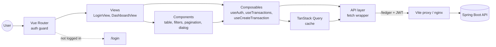

<div align="center">

# Secure Ledger Frontend

**Vue 3 dashboard to add and see your transactions in the Secure Ledger API**


</div>

## Features

- Login with JWT kept in memory
- Transactions table with sorting, pagination and date filter
- Create transaction dialog with validation
- Idempotency key on every new transaction
- Toasts and alerts for API errors
- Works on phone, tablet and desktop

## Getting started

The full stack is started from the [backend repository](https://github.com/AwosKanaan/secure-ledger), you need to clone both repositories in same folder

```bash
git clone https://github.com/AwosKanaan/secure-ledger.git
git clone https://github.com/AwosKanaan/secure-ledger-frontend.git
cd secure-ledger
docker compose up --build
```

Then open http://localhost:5173 and login with `gilbert@gmail.com` / `gilbert123` or `bob@ledger.test` / `Ledger-Test-2026!`

For local development (the API must run on http://localhost:8080)

```bash
npm install
npm run dev       # http://localhost:5173
npm run build     # type check and build to dist/
```

## Architecture



```
src
├── api           HTTP calls
├── composables   state and logic
├── components    UI parts
├── views         pages
├── utils         validation and formatting
└── router.ts     routes and auth guard
```

## Configuration

The app calls `/ledger` on same origin, Vite or nginx forward it to the API

| Variable           | Default                 | What it does                                  |
|--------------------|-------------------------|-----------------------------------------------|
| `API_PROXY_TARGET` | `http://localhost:8080` | API address for the dev proxy                 |
| `VITE_API_URL`     | empty (same origin)     | API base URL on other origin, set at build time |
